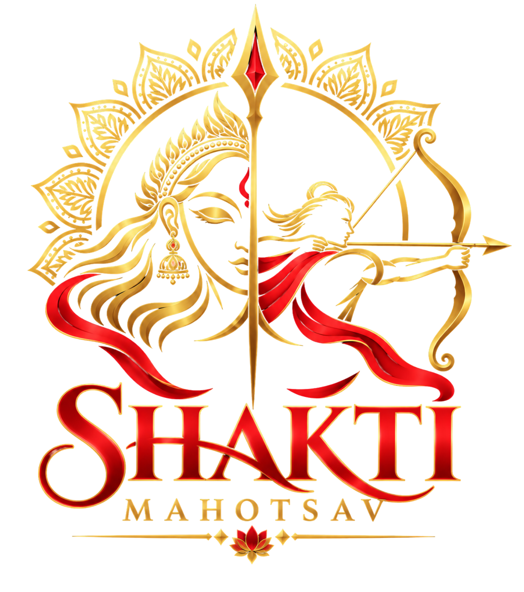

  

  <h1>Shakti Mahotsav 2026</h1>
  
<em>"Different People · Different Talents · One Shakti"</em>

---

## About

Shakti Mahotsav is the annual Navaratri cultural festival of Amrita Vishwa Vidyapeetham, Chennai. Celebrated across ten sacred nights, the festival honours the nine divine forms of Goddess Durga — the Navadurga — through art, music, dance, and devotion.

Each evening begins with the sacred **Maha Deeparadhana** and unfolds into a vibrant celebration of culture, talent, and spiritual energy.

## Festival Dates

**October 11 – October 20, 2026**
Evening celebrations begin daily at **4:00 PM IST**.

## Navaratri

Navaratri (Sanskrit: *nine nights*) is one of the most sacred Hindu festivals, dedicated to the worship of Goddess Shakti. Each of the nine nights celebrates a different manifestation of the Divine Mother, culminating in **Vijayadasami** — the day of victory of good over evil.

| Night | Goddess | Significance |
|-------|---------|--------------|
| 1 | Shailputri | Daughter of the mountains |
| 2 | Brahmacharini | Penance and devotion |
| 3 | Chandraghanta | Courage and grace |
| 4 | Kushmanda | Creator of the universe |
| 5 | Skandamata | Mother of Skanda |
| 6 | Katyayani | Warrior goddess |
| 7 | Kalaratri | Destroyer of darkness |
| 8 | Mahagauri | Purity and serenity |
| 9 | Siddhidatri | Bestower of blessings |

## Contact

**Email:** shaktimahotsav.amritachennai@gmail.com
**Phone:** +91 91822 60650

---

  Made with ♥ by Shakti Mahotsav Team · Amrita Vishwa Vidyapeetham

